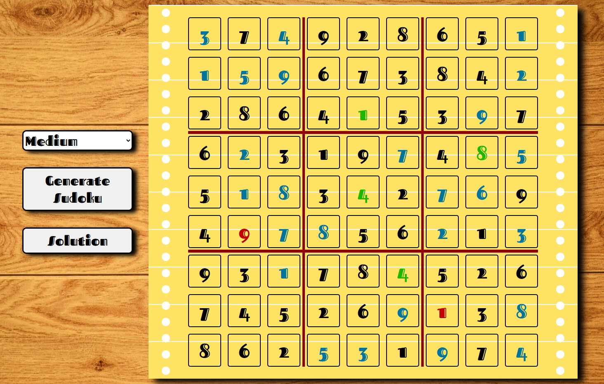

# Sudoku-Generator-JS-Application

A web application capable of generating a unique random sudoku with varying levels of difficulty coded in JavaScript.


## Deployment

To deploy this project first install [git](https://git-scm.com/) and [Docker](https://www.docker.com/), then run the command git clone inside a folder of your choosing:

```bash
git clone https://github.com/AndreaVitti/Sudoku-Generator-JS-app.git
```

Open the cloned repo and find the folder containing the file **compose.yaml**: there open your terminal and run the following command:

```bash
docker-compose up --build -d
```
This will build the container for the application the just paste this url in your browser: http://localhost:4205

## Functions
To start the application simply choose the difficulty through the drop down menu and simply click on the generate button.  
There are currently 4 diffculties:
- Easy: 61 hints
- Medium: 49 hints 
- Hard: 37 hints
- Very hard: 25 hints

Due to the nature of how the backtracking algorithm works in this repo sometimes a unique solution for the desidered difficulty might not be achieved within a certain amount of tries, in that case the program will simply ask you to retry ( this very hardly happens with diffculties below the very hard category).


## How to play
To play simply click an empty cell and select a number from 1 to 9 so that there will be no duplicates of that number in both its row and column and also in its 3x3 sub-grid.  
To reveal the solution simply click the solution button:
- 🟦 dark blue --> number not inserted
- 🟥 red --> wrong number 
- 🟩 green --> correct number


## Technologies used
To create this project it has been used the Angular framework and to deploy it Docker.